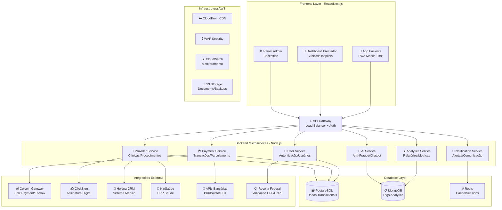

# Arquitetura Geral do Sistema

A arquitetura do MedPay Saúde foi projetada para ser altamente escalável, segura e modular, utilizando as melhores práticas de desenvolvimento de software moderno.

## Diagrama de Arquitetura

## Camadas da Arquitetura

### 🎨 Frontend Layer
**Tecnologia:** React 18 + Next.js
- **App Paciente:** Interface mobile-first para pacientes
- **Dashboard Prestador:** Painel para clínicas e hospitais
- **Painel Admin:** Interface de administração do sistema

### 🚪 API Gateway
**Função:** Ponto único de entrada para todas as APIs
- Load balancing automático
- Autenticação e autorização centralizadas
- Rate limiting e proteção contra ataques

### 🔧 Backend Microservices
**Arquitetura:** Microserviços em Node.js
- **User Service:** Gestão de usuários e autenticação
- **Payment Service:** Processamento de pagamentos e parcelamentos
- **Provider Service:** Gestão de clínicas e procedimentos
- **Analytics Service:** Relatórios e métricas
- **Notification Service:** Sistema de alertas e comunicação
- **AI Service:** Anti-fraude e funcionalidades inteligentes

### 🗄️ Database Layer
**Tecnologias:** PostgreSQL, MongoDB, Redis
- **PostgreSQL:** Dados transacionais estruturados
- **MongoDB:** Logs, analytics e dados não estruturados
- **Redis:** Cache de sessão e dados temporários

### 🔗 External Integrations
**Integrações Estratégicas:**
- **Celcoin:** Gateway de pagamento com split payment
- **ClickSign:** Assinatura digital de contratos
- **Helena/NinSaúde:** Sistemas médicos existentes
- **APIs Bancárias:** PIX, boleto, TED
- **Receita Federal:** Validação de documentos

### ☁️ Infrastructure AWS
**Serviços Utilizados:**
- **CloudFront:** CDN para distribuição global
- **WAF:** Web Application Firewall
- **CloudWatch:** Monitoramento e alertas
- **S3:** Armazenamento de documentos e backups