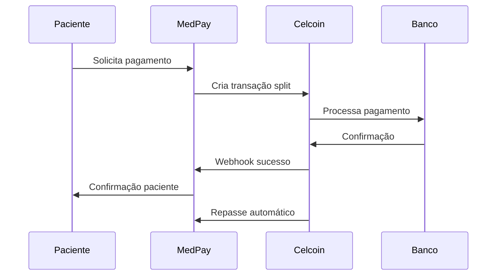
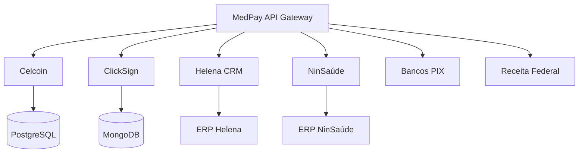

# Integrações e APIs

O MedPay Saúde foi projetado como uma plataforma aberta, com um robusto sistema de integrações que permite conectar-se aos principais players do ecossistema de saúde e financeiro brasileiro.

## 💰 Gateway de Pagamento - Celcoin

### Funcionalidades Integradas
- **Split Payment:** Divisão automática de pagamentos entre múltiplos beneficiários
- **Conta Escrow:** Garantia de recebimento para prestadores
- **PIX Instantâneo:** Transferências imediatas via PIX
- **Cartão de Crédito:** Processamento seguro com tokenização
- **Boleto Bancário:** Geração e compensação automática

### Benefícios Técnicos
- **API RESTful** bem documentada
- **Webhooks** para notificações em tempo real
- **Sandbox** completo para desenvolvimento
- **Compliance PCI DSS** Level 1
- **Suporte 24/7** com SLA garantido

### Fluxo de Integração

## ✍️ Assinatura Digital - ClickSign

### Casos de Uso
- **Contratos de prestação de serviço** entre pacientes e clínicas
- **Termos de adesão** à plataforma
- **Documentos médicos** com consentimento digital
- **Autorizações de tratamento** com assinatura legal

### Recursos Técnicos
- **API completa** para criação e envio de documentos
- **Assinatura em lote** para múltiplos signatários
- **Validação LGPD** com consentimento granular
- **Integração WhatsApp** para notificações
- **Audit trail** completo para compliance

## 🏥 Sistemas Médicos Existentes

### Helena CRM
**Integração:** API REST + Webhooks
- **Sincronização de pacientes** em tempo real
- **Cadastro de procedimentos** automatizado
- **Histórico médico** integrado
- **Agendamentos** bidirecionais

### NinSaúde ERP
**Integração:** Database sync + APIs
- **Faturamento integrado** com procedimentos
- **Controle de estoque** de materiais médicos
- **Relatórios financeiros** unificados
- **Auditoria médica** compliance

## 🏦 APIs Bancárias

### PIX (Sistema Brasileiro)
- **Integração direta** com bancos participantes
- **QR Code dinâmico** para pagamentos
- **Devolução automática** para estornos
- **Conciliacão automática** diária

### TED e Boleto
- **Processamento automático** de repasses
- **Geração de boletos** com registro
- **Compensação** em tempo real
- **Relatórios de liquidação**

## 📋 Validações Governamentais

### Receita Federal
**API de Validação:** CPF/CNPJ
- **Consulta em tempo real** durante cadastro
- **Cache inteligente** para performance
- **Tratamento de contingências** (APIs offline)
- **Logs de auditoria** para compliance

## 🔧 Arquitetura de Integração

### API Gateway Centralizado

### Padrões Implementados

#### Circuit Breaker Pattern
- **Fallback automático** em caso de indisponibilidade
- **Retry inteligente** com backoff exponencial
- **Monitoramento** de health checks
- **Alertas** para equipe técnica

#### Event-Driven Architecture
- **Webhooks** para eventos assíncronos
- **Message queues** para processamento resiliente
- **Dead letter queues** para tratamento de erros
- **Event sourcing** para auditoria

#### API Versioning
- **Versionamento semântico** (v1, v2, etc.)
- **Backward compatibility** mantida
- **Deprecation warnings** com antecedência
- **Documentation** atualizada automaticamente

## 📊 Monitoramento de Integrações

### Health Checks
- **Status pages** públicas para cada integração
- **Métricas em tempo real** (latency, error rates)
- **Alertas automáticos** via Slack/PagerDuty
- **Dashboards** no Grafana/Kibana

### Logging Estruturado
- **Correlation IDs** para rastreamento distribuído
- **Log levels** apropriados (DEBUG, INFO, WARN, ERROR)
- **ELK Stack** para centralização e análise
- **Retention policies** por tipo de log

### Testing de Integração
- **Contract testing** com Pact
- **Mock servers** para desenvolvimento
- **Load testing** automatizado
- **Chaos engineering** para resiliência

## 🔒 Segurança nas Integrações

### Autenticação e Autorização
- **OAuth 2.0 + OpenID Connect** para APIs externas
- **API Keys** com rotação automática
- **mTLS** para comunicações críticas
- **JWT** com expiração curta

### Proteção de Dados
- **Encryption at rest** em todos os armazenamentos
- **TLS 1.3** para todas as comunicações
- **Data masking** em logs e monitoramentos
- **Right to be forgotten** implementado

### Compliance
- **LGPD compliance** em todas as integrações
- **PCI DSS** para dados de pagamento
- **Auditoria independente** anual
- **Penetration testing** trimestral

Este sistema de integrações garante que o MedPay Saúde possa **conectar-se perfeitamente** ao ecossistema existente, maximizando o valor para todos os stakeholders enquanto mantém os mais altos padrões de segurança e compliance.