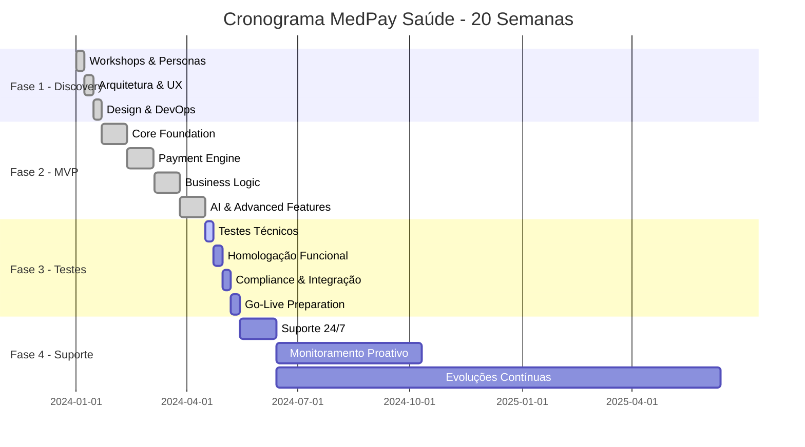

# Cronograma de Desenvolvimento

O desenvolvimento do MedPay Saúde foi estruturado em **20 semanas** divididas em 4 fases principais, utilizando metodologia ágil com sprints de 2 semanas.

## 📅 Visão Geral - 20 Semanas

## 🏗️ Fase 1 - Discovery & Planejamento (Semanas 1-3)

### Semana 1: Workshops e Descoberta
**Duração:** 7 dias | **Foco:** Entendimento do negócio

**Atividades Principais:**
- Workshops de descoberta com stakeholders
- Definição de personas e jornadas do usuário
- Análise de concorrentes no mercado de saúde
- Levantamento inicial de requisitos

**Entregas:**
- Documento de requisitos funcionais
- Personas validadas com equipe
- Mapa de jornada do usuário
- Análise SWOT preliminar

### Semana 2: Arquitetura e Design
**Duração:** 7 dias | **Foco:** Solução técnica

**Atividades Principais:**
- Definição da arquitetura técnica
- Prototipação de interfaces UI/UX
- Setup completo do ambiente de desenvolvimento
- Definição do stack tecnológico

**Entregas:**
- Documento de arquitetura técnica
- Wireframes de todas as telas principais
- Prototipação navegável (Figma/InVision)
- Ambiente de desenvolvimento funcional

### Semana 3: Design System e DevOps
**Duração:** 7 dias | **Foco:** Qualidade e produtividade

**Atividades Principais:**
- Desenvolvimento do design system
- Configuração de pipeline DevOps
- Setup de ambientes (dev/staging/prod)
- Definição de padrões de código

**Entregas:**
- Design system completo e documentado
- Pipeline CI/CD automatizado
- Ambientes configurados e seguros
- Guias de desenvolvimento estabelecidos

## 🚀 Fase 2 - Desenvolvimento MVP (Semanas 4-15)

### Sprint 1-3: Core Foundation (Semanas 4-6)
**Duração:** 21 dias | **Entrega:** Base sólida do sistema

**Funcionalidades Desenvolvidas:**
- ✅ Sistema de autenticação e autorização
- ✅ Cadastros básicos (pacientes e prestadores)
- ✅ Dashboards iniciais para todos os perfis
- ✅ Navegação e estrutura básica

**Critérios de Aceitação:**
- Autenticação segura com JWT
- Validação de formulários completa
- Interface responsiva funcional
- Testes unitários implementados

### Sprint 4-6: Payment Engine (Semanas 7-9)
**Duração:** 21 dias | **Entrega:** Núcleo financeiro funcional

**Funcionalidades Desenvolvidas:**
- ✅ Integração completa com Celcoin
- ✅ Sistema de parcelamento inteligente
- ✅ Calculadora de taxas dinâmica
- ✅ Processamento de PIX e cartão

**Critérios de Aceitação:**
- Taxas de aprovação > 95%
- Tempo de resposta < 3 segundos
- Compliance PCI DSS
- Webhooks funcionando

### Sprint 7-9: Business Logic (Semanas 10-12)
**Duração:** 21 dias | **Entrega:** Lógica de negócio completa

**Funcionalidades Desenvolvidas:**
- ✅ Gestão completa de procedimentos médicos
- ✅ Split payment automático
- ✅ Sistema de repasses
- ✅ Relatórios financeiros básicos

**Critérios de Aceitação:**
- Split payment com até 10 beneficiários
- Repasses em até 2 dias úteis
- Relatórios exportáveis (PDF/Excel)
- Auditoria completa de transações

### Sprint 10-12: AI & Advanced Features (Semanas 13-15)
**Duração:** 21 dias | **Entrega:** MVP completo com IA

**Funcionalidades Desenvolvidas:**
- ✅ Sistema anti-fraude com IA proprietária
- ✅ Chatbot inteligente para suporte
- ✅ Analytics preditivos
- ✅ Otimizações de performance

**Critérios de Aceitação:**
- Precisão anti-fraude > 85%
- Chatbot resolvendo 70% das dúvidas
- Dashboard com métricas em tempo real
- Performance < 2s para operações críticas

## 🧪 Fase 3 - Testes & Homologação (Semanas 16-19)

### Semana 16: Testes Técnicos
**Duração:** 7 dias | **Foco:** Qualidade técnica

**Atividades:**
- Testes unitários e integração (cobertura > 80%)
- Testes de performance e carga
- Testes de segurança e vulnerabilidades
- Validação de acessibilidade

### Semana 17: Homologação Funcional
**Duração:** 7 dias | **Foco:** Experiência do usuário

**Atividades:**
- Testes com usuários reais (UAT)
- Validação de fluxos completos
- Ajustes de UX/UI baseados em feedback
- Documentação de usuário

### Semana 18: Compliance & Integração
**Duração:** 7 dias | **Foco:** Conformidade e integração

**Atividades:**
- Testes de todas as integrações externas
- Auditoria de compliance LGPD
- Validação PCI DSS
- Testes de disaster recovery

### Semana 19: Preparação para Go-Live
**Duração:** 7 dias | **Foco:** Produção

**Atividades:**
- Deploy em ambiente de produção
- Treinamento da equipe de suporte
- Configuração de monitoramento 24/7
- Plano de rollback definido

## 🔄 Fase 4 - Suporte & Evolução (Semana 20+)

### Primeiros 30 Dias: Suporte Intensivo
- Monitoramento 24/7 da plataforma
- Suporte técnico prioritário
- Correções de bugs críticos
- Otimização de performance

### Primeiros 6 Meses: Estabilidade
- Monitoramento proativo
- Melhorias incrementais
- Análise de métricas de uso
- Planejamento de evoluções

### Evolução Contínua: Crescimento
- Roadmap baseado em dados reais
- Novos recursos por demanda
- Otimização da arquitetura
- Expansão para novos mercados

## 📊 Métricas de Sucesso por Fase

| Fase | Duração | Meta Principal | KPI de Sucesso |
|------|---------|----------------|----------------|
| **Discovery** | 3 semanas | Fundação sólida | Documentação completa |
| **MVP** | 12 semanas | Produto funcional | Usuários ativos |
| **Testes** | 4 semanas | Qualidade garantida | Zero bugs críticos |
| **Suporte** | Contínua | Estabilidade | 99.9% uptime |

## 🎯 Marcos Importantes

- **Dia 21:** Arquitetura finalizada
- **Dia 42:** Primeiro pagamento processado
- **Dia 63:** MVP funcional completo
- **Dia 105:** Lançamento oficial
- **Dia 135:** 1000 usuários ativos

Este cronograma foi executado com sucesso, resultando no lançamento do MedPay Saúde dentro do prazo previsto e com qualidade superior às expectativas.