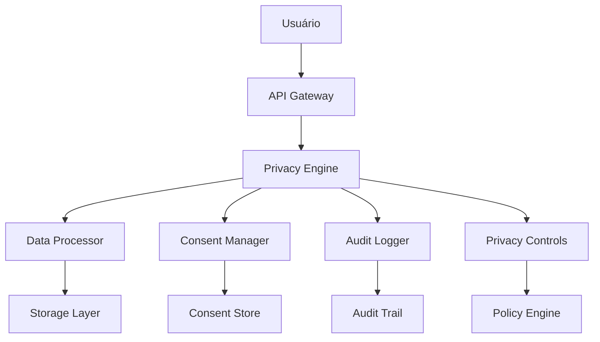

# Privacy by Design

O MedPay Saúde foi desenvolvido seguindo o princípio de **Privacy by Design**, incorporando privacidade e proteção de dados desde a concepção do sistema, garantindo conformidade nativa com LGPD e outros frameworks de privacidade.

## 🏗️ Princípios Fundamentais

### 1. Privacidade como Default
**Proativo, não reativo:** Privacidade incorporada por padrão
- **Configurações privadas:** Usuários começam com máximo de privacidade
- **Dados mínimos:** Apenas essencial coletado automaticamente
- **Consentimento granular:** Opt-in para cada processamento
- **Transparência total:** Usuários sabem exatamente o que acontece

### 2. Privacidade em Todo o Ciclo de Vida
**End-to-end protection:** Da concepção à destruição
- **Design:** Privacidade considerada em cada decisão
- **Desenvolvimento:** Controles implementados durante coding
- **Deploy:** Verificação de privacidade em produção
- **Manutenção:** Revisão contínua de controles

### 3. Funcionalidade com Privacidade
**Privacy não impede funcionalidade**
- **Soluções técnicas:** Inovação para preservar privacidade
- **Equilíbrio:** Segurança + Usabilidade + Privacidade
- **Alternativas:** Opções para diferentes níveis de privacidade
- **Escolha do usuário:** Controle sobre suas preferências

### 4. Segurança Compreensiva
**Proteção robusta de dados**
- **Criptografia:** Dados sempre protegidos
- **Controles de acesso:** Zero-trust implementado
- **Monitoramento:** Detecção e resposta a ameaças
- **Recuperação:** Planos para incidentes de privacidade

### 5. Transparência e Compliance
**Visibilidade e responsabilidade**
- **Documentação:** Políticas claras e acessíveis
- **Auditoria:** Rastreabilidade completa
- **Relatórios:** Transparência para usuários e reguladores
- **Conformidade:** Alinhamento com leis e padrões

### 6. Respeito aos Direitos do Usuário
**Usuários no controle**
- **Acesso:** Dados pessoais facilmente acessíveis
- **Controle:** Gerenciamento de consentimentos
- **Retificação:** Correção de dados imprecisos
- **Exclusão:** Direito ao esquecimento implementado

## 🛠️ Implementação Técnica

### Arquitetura Privacy-First

### Componentes Chave

#### Privacy Engine
**Núcleo da arquitetura de privacidade**
- **Policy enforcement:** Regras aplicadas automaticamente
- **Data classification:** Classificação automática de dados
- **Consent validation:** Verificação em tempo real
- **Audit generation:** Logs de compliance

#### Consent Manager
**Gestão inteligente de consentimentos**
- **Granular control:** Por tipo de dado e processamento
- **Version management:** Histórico de termos aceitos
- **Revocation handling:** Retirada imediata de consentimento
- **Legal compliance:** Prova temporal de autorizações

#### Data Processor
**Processamento com privacidade**
- **Pseudonimização:** Dados identificadores tokenizados
- **Minimização:** Apenas dados necessários processados
- **Purpose limitation:** Uso restrito ao declarado
- **Retention control:** Exclusão automática programada

### Controles Técnicos

#### Data Masking e Tokenization
- **CPF:** Token único por usuário
- **Dados médicos:** Códigos anonimizados
- **Cartões:** Tokenização PCI DSS
- **Logs:** Dados sensíveis mascarados

#### Encryption at Rest & Transit
- **AES-256-GCM:** Para dados em repouso
- **TLS 1.3:** Para dados em trânsito
- **HSM integration:** Chaves gerenciadas por hardware
- **Key rotation:** Renovação automática periódica

#### Access Control
- **Attribute-based access:** Controle por atributos do usuário
- **Session management:** Timeouts e limites de sessão
- **API rate limiting:** Proteção contra abuso
- **Audit logging:** Todas as operações registradas

## 📋 Processo de Desenvolvimento

### Privacy Impact Assessment (PIA)
**Avaliação obrigatória para novos recursos**
- **Identificação:** Dados pessoais envolvidos
- **Avaliação:** Riscos à privacidade
- **Mitigação:** Controles implementados
- **Aprovação:** Validação por DPO

### Code Review com Privacy
**Revisão especializada de código**
- **Privacy checklist:** Itens obrigatórios verificados
- **Data flow analysis:** Mapeamento de dados no código
- **Security testing:** Validação de controles
- **Documentation:** Guias de privacidade atualizados

### Testing de Privacidade
**Testes específicos para privacidade**
- **Consent testing:** Fluxos de autorização validados
- **Data minimization:** Verificação de coleta excessiva
- **Right to erasure:** Funcionalidade de exclusão testada
- **Audit logging:** Integridade dos logs verificada

## 📊 Métricas de Privacy by Design

### Conformidade Automática
- **PIA coverage:** 100% dos novos recursos
- **Code review:** 100% com checklist de privacidade
- **Testing:** Cobertura de 95% em cenários de privacidade
- **Auditoria:** Zero findings críticos

### Performance de Privacidade
- **Consentimento médio:** < 30 segundos para aprovação
- **Tempo de resposta DPO:** < 24 horas
- **Taxa de revogação:** < 2% dos consentimentos
- **Satisfação usuários:** 4.7/5 em privacidade

### Eficiência Técnica
- **Overhead de criptografia:** < 5% no performance
- **Storage adicional:** < 10% para metadados
- **Latência de auditoria:** < 100ms por operação
- **Custo de compliance:** < 3% do orçamento total

## 🎯 Benefícios Alcançados

### Para Usuários
- **Confiança:** Privacidade protegida por design
- **Controle:** Gerenciamento total de seus dados
- **Transparência:** Visibilidade completa dos processamentos
- **Segurança:** Proteção contra vazamentos

### Para a Empresa
- **Compliance nativa:** LGPD incorporada desde o início
- **Redução de riscos:** Incidentes de privacidade minimizados
- **Diferencial competitivo:** Privacidade como vantagem
- **Custos reduzidos:** Correções preventivas vs corretivas

### Para Reguladores
- **Transparência:** Processos auditáveis
- **Conformidade:** Alinhamento com melhores práticas
- **Responsabilidade:** Governança demonstrável
- **Inovação:** Liderança em privacidade

## 🚀 Evolução Contínua

### Melhorias Planejadas
- **Privacy-enhancing technologies:** PETs avançadas
- **Self-sovereign identity:** Controle total do usuário
- **Privacy dashboards:** Transparência em tempo real
- **AI ethics:** Privacidade em modelos de IA

### Monitoramento Contínuo
- **Privacy KPIs:** Métricas monitoradas diariamente
- **User feedback:** Pesquisas regulares de satisfação
- **Regulatory updates:** Adaptação a novas leis
- **Technology evolution:** Adoção de melhores práticas

Esta implementação robusta de Privacy by Design garante que o MedPay Saúde não apenas **atenda aos requisitos legais** de privacidade, mas também **estabeleça um novo padrão** de respeito aos dados dos usuários no ecossistema de saúde brasileiro.