# Arquitetura Técnica - MedPay Saúde

## Visão Geral da Infraestrutura

```mermaid
graph TD
    %% Frontend Layer
    subgraph "Frontend Layer - React/Next.js"
        A[📱 App Paciente<br/>PWA Mobile-First] 
        B[💼 Dashboard Prestador<br/>Clínicas/Hospitais]
        C[⚙️ Painel Admin<br/>Backoffice]
    end

    %% API Gateway
    D[🚪 API Gateway<br/>Load Balancer + Auth]

    %% Backend Microservices
    subgraph "Backend Microservices - Node.js"
        E[👤 User Service<br/>Autenticação/Usuários]
        F[💳 Payment Service<br/>Transações/Parcelamento]
        G[🏥 Provider Service<br/>Clínicas/Procedimentos]
        H[📊 Analytics Service<br/>Relatórios/Métricas]
        I[🔔 Notification Service<br/>Alertas/Comunicação]
        J[🤖 AI Service<br/>Anti-Fraude/Chatbot]
    end

    %% Database Layer
    subgraph "Database Layer"
        K[(🗃️ PostgreSQL<br/>Dados Transacionais)]
        L[(📋 MongoDB<br/>Logs/Analytics)]
        M[⚡ Redis<br/>Cache/Sessions]
    end

    %% External Integrations
    subgraph "Integrações Externas"
        N[💰 Celcoin Gateway<br/>Split Payment/Escrow]
        O[✍️ ClickSign<br/>Assinatura Digital]
        P[🏥 Helena CRM<br/>Sistema Médico]
        Q[🏥 NinSaúde<br/>ERP Saúde]
        R[🏦 APIs Bancárias<br/>PIX/Boleto/TED]
        S[📋 Receita Federal<br/>Validação CPF/CNPJ]
    end

    %% Infrastructure
    subgraph "Infraestrutura AWS"
        T[☁️ CloudFront CDN]
        U[🔒 WAF Security]
        V[📊 CloudWatch<br/>Monitoramento]
        W[💾 S3 Storage<br/>Documents/Backups]
    end

    %% Connections
    A --> D
    B --> D
    C --> D
    
    D --> E
    D --> F
    D --> G
    D --> H
    D --> I
    D --> J
    
    E --> K
    E --> M
    F --> K
    F --> M
    G --> K
    H --> L
    I --> K
    I --> M
    J --> L
    J --> M
    
    F --> N
    E --> O
    G --> P
    G --> Q
    F --> R
    E --> S
    
    T --> D
    U --> D
    V --> E
    V --> F
    V --> G
    V --> H
    V --> I
    V --> J
    
    E --> W
    F --> W
    G --> W
    H --> W

    %% Styling
    classDef frontend fill:#e1f5fe
    classDef backend fill:#f3e5f5
    classDef database fill:#e8f5e8
    classDef integration fill:#fff3e0
    classDef infrastructure fill:#fce4ec

    class A,B,C frontend
    class E,F,G,H,I,J backend
    class K,L,M database
    class N,O,P,Q,R,S integration
    class T,U,V,W infrastructure
```

## Componentes Principais

### **Frontend Layer**
- **App Paciente**: Interface mobile-first para pacientes realizarem pagamentos
- **Dashboard Prestador**: Painel para clínicas e hospitais gerenciarem pagamentos e repasses
- **Painel Admin**: Backoffice para administração do sistema

### **Backend Microservices**
- **User Service**: Gerenciamento de autenticação e usuários
- **Payment Service**: Processamento de transações e parcelamentos
- **Provider Service**: Gestão de clínicas, procedimentos e prestadores
- **Analytics Service**: Relatórios e métricas de negócio
- **Notification Service**: Sistema de alertas e comunicações
- **AI Service**: Anti-fraude proprietário e chatbot inteligente

### **Banco de Dados**
- **PostgreSQL**: Dados transacionais principais
- **MongoDB**: Logs, analytics e dados não-estruturados
- **Redis**: Cache e gerenciamento de sessões

### **Integrações Externas**
- **Celcoin**: Gateway de pagamentos com split payment
- **ClickSign**: Assinatura digital de contratos
- **Helena/NinSaúde**: Sistemas médicos brasileiros
- **APIs Bancárias**: PIX, boleto, TED
- **Receita Federal**: Validação de documentos

### **Infraestrutura AWS**
- **CloudFront**: CDN para distribuição global
- **WAF**: Firewall de aplicações web
- **CloudWatch**: Monitoramento e observabilidade
- **S3**: Armazenamento de documentos e backups